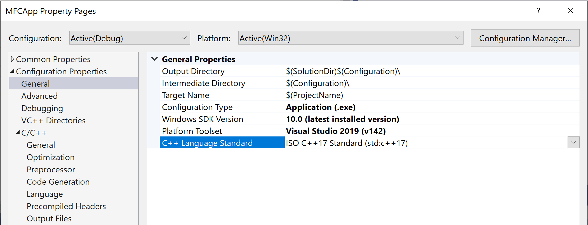
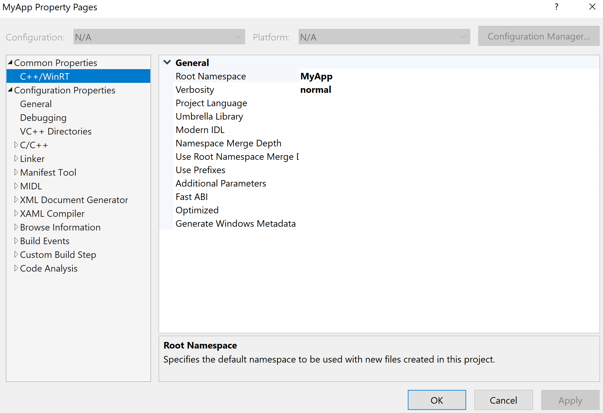
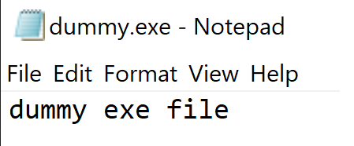
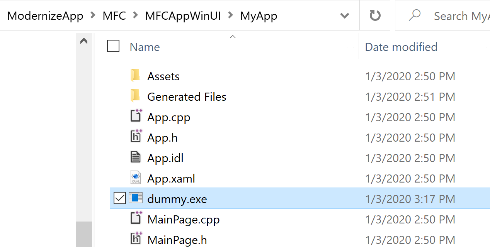

# Host Custom UWP Controls in MFC MDI Project using XAML Islands

This article explains how to modernize MFC MDI project with custom UWP Controls through XAML Islands. With custom UWP controls, it allows us to define control layout easily through XAML pages. Not only putting standard UWP controls into the custom control, we can also integrate other custom controls as well, such as latest WinUI controls. We will use a new Xaml Application project to bring the custom UWP controls into our MFC project. This [article](https://docs.microsoft.com/en-us/windows/apps/desktop/modernize/using-the-xaml-hosting-api#host-a-custom-uwp-control) has mentioned how to use the new XAML application in Win32 C++ application, we will give more detailed steps for MFC project.

Overall, in our MFC project, we will have two parts to demonstrate this method:

* MFC MDI Project
* A companion UWP app project that defines a XamlApplication object.  
  In this project, we will define a custom UWP control and export it so that MFC can use the custom UWP control.

## Development Environment  

* Visual Studio 2019 (16.3.6)  
* Windows 10 1909 (18363.476)  
* Windows 10 SDK (10.0.18362.1)  

## Configure MFC Project

1. Create MFC App in Visual Studio 2019, will name it MFCAPP

    

    Use below configuration to create the MFCAPP project
    
    

    click **Finish** Build and Run it, here is its default UI

     

    
  
2. In Solution Explorer, right-click the MFCAPP project node,    click **Retarget Project**, select the **10.0.18362.0** or    a later SDK release, and then click OK.
 
   

   
 
3.	Install the Microsoft.Windows.CppWinRT NuGet package:

    a.	Right-click the project in Solution Explorer and choose Manage NuGet Packages.
    b.	Select the Browse tab, search for the **Microsoft.Windows.CppWinRT** package, and install the latest version of this package.  

      


    After install the nuget package, check the MFC project properties, you will notice its C++ version is ISO C++17, which is required by C++/WinRT:

    
 
    Build this MFCApp, we can see winrt projected files are generated in the “Generated Files\winrt” folder:

    
 

4.	Install the **Microsoft.Toolkit.Win32.UI.SDK** NuGet          package:

    a.	In the NuGet Package Manager window, make sure that Include prerelease is selected.  
    b.	Select the Browse tab, search for the **Microsoft.Toolkit.Win32.UI.SDK** package, and install version v6.0.0 (or Later) of this package.

    

## Configure UWP Project

1. In Solution Explorer, right-click the solution node and select Add -> New Project.

2. Add a Blank App (C++/WinRT) project to your solution. 


3. Give it a name ***MyApp***, and create it, Make sure the target version and minimum version are ***both*** set to Windows 10, version 1903 or later.


4. Right click the MyApp and open its properties, make sure its C++/WinRT configuration is as below:



5. Change its output type from .EXE to Dynamic Library


6. Save a dummy.exe into the ***MyApp*** folder. It doesn't need to be a real exe, just input "dummy exe file" in notepad, and save it as ***dummy.exe***, that's all.





7. Now edit Package.appxmanifest, change the Executable attribute to "dummy.exe"


8. Right click the ***MyApp*** project, select ***Unload Project***

9. Right click the ***MyApp (Unloaded)*** project, select ***Edit MyApp.vcxproj***

10. Add below properties to the ***MyApp.vcxproj*** project file:

```XML
<PropertyGroup Label="Globals">
    <WindowsAppContainer>true</WindowsAppContainer>
    <AppxGeneratePriEnabled>true</AppxGeneratePriEnabled>
    <ProjectPriIndexName>App</ProjectPriIndexName>
    <AppxPackage>true</AppxPackage>
  </PropertyGroup>
```

For example:


11. Right click the ***MyApp (Unloaded)*** project, select ***Reload Project***.

12. Right click the Win32 Project ***MFCApp***, select ***Unload Project***

13. Right click the ***MFCApp (Unloaded)*** project, select ***Edit MFCApp.vcxproj***

14. Add below properties to the ***MFCApp.vcxproj*** project file before the ***"<Import Project=""$(VCTargetsPath)\Microsoft.Cpp.targets" />"*** line:

```XML
  <PropertyGroup>
    <AppProjectName>MyApp</AppProjectName>
  </PropertyGroup>
  <PropertyGroup>
    <AppIncludeDirectories>$(SolutionDir)\obj\$(Platform)\$(Configuration)\$(AppProjectName)\;$(SolutionDir)\obj\$(Platform)\$(Configuration)\$(AppProjectName)\Generated Files\;</AppIncludeDirectories>
  </PropertyGroup>
    <ItemGroup>
    <NativeReferenceFile Include="$(SolutionDir)\bin\$(Platform)\$(Configuration)\$(AppProjectName)\*.xbf">
      <DeploymentContent>true</DeploymentContent>
      <CopyToOutputDirectory>PreserveNewest</CopyToOutputDirectory>
    </NativeReferenceFile>
    <NativeReferenceFile Include="$(SolutionDir)\bin\$(Platform)\$(Configuration)\$(AppProjectName)\*.dll">
      <DeploymentContent>true</DeploymentContent>
      <CopyToOutputDirectory>PreserveNewest</CopyToOutputDirectory>
    </NativeReferenceFile>
    <NativeReferenceFile Include="$(SolutionDir)\bin\$(Platform)\$(Configuration)\$(AppProjectName)\resources.pri">
      <DeploymentContent>true</DeploymentContent>
      <CopyToOutputDirectory>PreserveNewest</CopyToOutputDirectory>
    </NativeReferenceFile>
  </ItemGroup>
  <------Right Here--------->
  <Import Project="$(VCTargetsPath)\Microsoft.Cpp.targets" />
```


