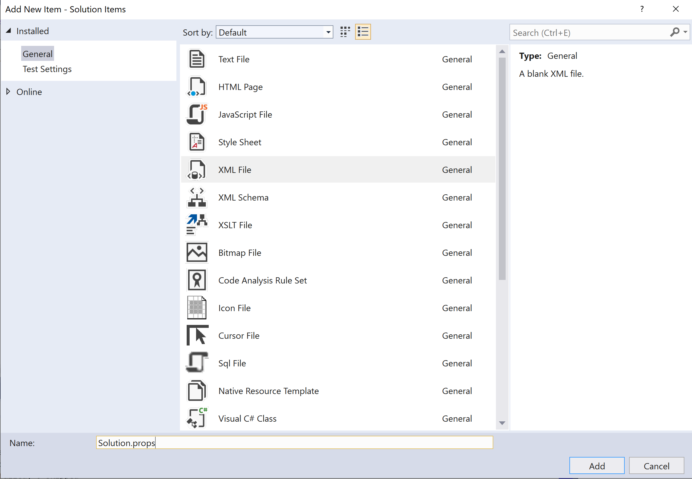
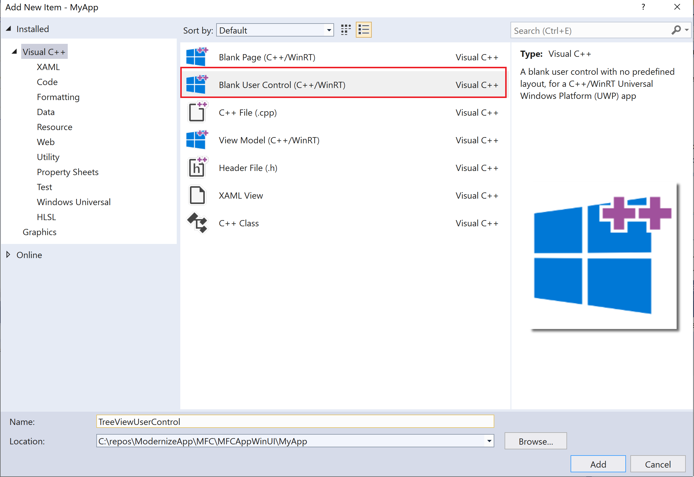
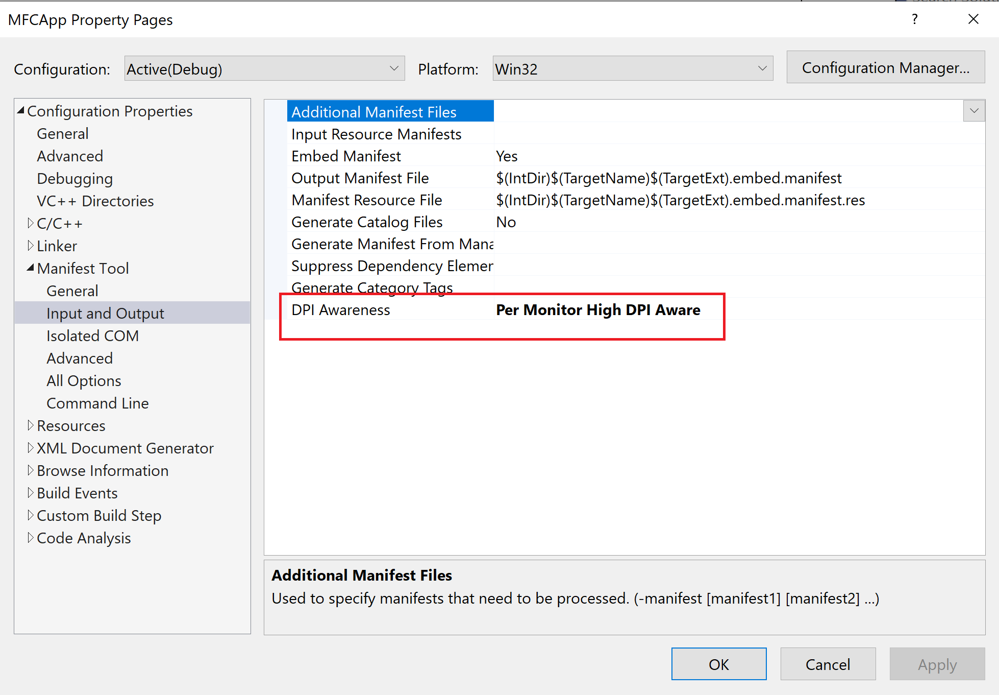
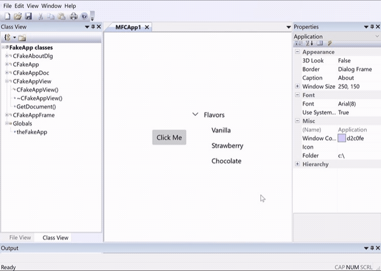

# Host Custom UWP Controls in MFC MDI Project using XAML Islands

This article explains how to modernize MFC MDI project with custom UWP Controls through XAML Islands. With custom UWP controls, it allows us to define control layout easily through XAML pages. Not only putting standard UWP controls into the custom control, we can also integrate other custom controls as well, such as latest WinUI controls. We will use a new Xaml Application project to bring the custom UWP controls into our MFC project. This [article](https://docs.microsoft.com/en-us/windows/apps/desktop/modernize/using-the-xaml-hosting-api#host-a-custom-uwp-control) has mentioned how to use the new XAML application in Win32 C++ application, we will give more detailed steps for MFC project.

Overall, in our MFC project, we will have two parts to demonstrate this method:

* MFC MDI Project
* A companion UWP app project that defines a XamlApplication object.  
  In this project, we will define a custom UWP control and export it so that MFC can use the custom UWP control.

## Development Environment  

* Visual Studio 2019 (16.3.6)  
* Windows 10 1909 (18363.476)  
* Windows 10 SDK (10.0.18362.1)  

## Configure MFC Project

1. Create MFC App in Visual Studio 2019, will name it MFCAPP

    

    Use below configuration to create the MFCAPP project
    
    

    click **Finish** Build and Run it, here is its default UI

     

    
  
2. In Solution Explorer, right-click the MFCAPP project node,    click **Retarget Project**, select the **10.0.18362.0** or    a later SDK release, and then click OK.
 
   

   
 
3.	Install the Microsoft.Windows.CppWinRT NuGet package:

    a.	Right-click the project in Solution Explorer and choose ***Manage NuGet Packages***.
    b.	Select the Browse tab, search for the **Microsoft.Windows.CppWinRT** package, and install the latest version of this package.  

      


    After install the nuget package, check the MFC project properties, you will notice its C++ version is ISO C++17, which is required by C++/WinRT:

    
 
    Build this MFCApp, we can see winrt projected files are generated in the “Generated Files\winrt” folder:

    
 

4.	Install the **Microsoft.Toolkit.Win32.UI.SDK** NuGet package:

    a.	In the NuGet Package Manager window, make sure that Include prerelease is selected.  
    b.	Select the Browse tab, search for the **Microsoft.Toolkit.Win32.UI.SDK** package, and install version v6.0.0 (or Later) of this package.

    

5. Install the ***Microsoft.VCRTForwarders.140*** nuget package as well. Running Custom UWP Control in this project will require VC libs.

     

## Configure UWP Project

1. In Solution Explorer, right-click the solution node and select Add -> New Project.

2. Add a Blank App (C++/WinRT) project to your solution. 

     

3. Give it a name ***MyApp***, and create it, Make sure the target version and minimum version are ***both*** set to ***Windows 10, version 1903*** or later.


4. Right click the MyApp and open its properties, make sure its C++/WinRT configuration is as below:

     

5. Change its output type from .EXE to Dynamic Library

     

6. Save a dummy.exe into the ***MyApp*** folder. It doesn't need to be a real exe, just input "dummy exe file" in notepad, and save it as ***dummy.exe***. 

     

     

    Make sure the Content property of dummy.exe is ***True***.

     

7. Now edit Package.appxmanifest, change the Executable attribute to "dummy.exe"


8. Right click the ***MyApp*** project, select ***Unload Project***

9. Right click the ***MyApp (Unloaded)*** project, select ***Edit MyApp.vcxproj***

10. Add below properties to the ***MyApp.vcxproj*** project file:

```XML
<PropertyGroup Label="Globals">
    <WindowsAppContainer>true</WindowsAppContainer>
    <AppxGeneratePriEnabled>true</AppxGeneratePriEnabled>
    <ProjectPriIndexName>App</ProjectPriIndexName>
    <AppxPackage>true</AppxPackage>
  </PropertyGroup>
```

For example:


11. Right click the ***MyApp (Unloaded)*** project, select ***Reload Project***.

12. Right click ***Mainpage.xml***, select ***Remove***. And then click ***Delete***

13. Copy App.Xaml, App.cpp, App.h, App.idl contents to overwrite current ones:

***App.Xaml***

```XML
<Toolkit:XamlApplication
    x:Class="MyApp.App"
    xmlns="http://schemas.microsoft.com/winfx/2006/xaml/presentation"
    xmlns:x="http://schemas.microsoft.com/winfx/2006/xaml"
    xmlns:local="using:MyApp"
    xmlns:Toolkit="using:Microsoft.Toolkit.Win32.UI.XamlHost"
    xmlns:d="http://schemas.microsoft.com/expression/blend/2008"
    xmlns:mc="http://schemas.openxmlformats.org/markup-compatibility/2006"
    RequestedTheme="Light"
    mc:Ignorable="d">
</Toolkit:XamlApplication>
```

***App.cpp***
```C++
#include "pch.h"
#include "App.h"

using namespace winrt;
using namespace Windows::UI::Xaml;

namespace winrt::MyApp::implementation
{
    App::App()
    {
        Initialize();

        AddRef();
        m_inner.as<::IUnknown>()->Release();
    }

    App::~App()
    {
        Close();
    }
}

```

***App.h***
```C++
//
// Declaration of the App class.
//

#pragma once

#include "App.g.h"
#include "App.base.h"

namespace winrt::MyApp::implementation
{
    class App : public AppT2<App>
    {
    public:
        App();
        ~App();
    };
}

namespace winrt::MyApp::factory_implementation
{
    class App : public AppT<App, implementation::App>
    {
    };
}

```
***App.idl***
```C++
namespace MyApp
{
    [default_interface]
    runtimeclass App: Microsoft.Toolkit.Win32.UI.XamlHost.XamlApplication
    {
        App();
    }
}

```
14. Create app.base.h in this project, and use below content:

***app.base.h***

```C++
#pragma once

namespace winrt::MyApp::implementation
{
    template <typename D, typename... I>
    struct App_baseWithProvider : public App_base<D, ::winrt::Windows::UI::Xaml::Markup::IXamlMetadataProvider>
    {
        using IXamlType = ::winrt::Windows::UI::Xaml::Markup::IXamlType;

        IXamlType GetXamlType(::winrt::Windows::UI::Xaml::Interop::TypeName const& type)
        {
            return AppProvider()->GetXamlType(type);
        }

        IXamlType GetXamlType(::winrt::hstring const& fullName)
        {
            return AppProvider()->GetXamlType(fullName);
        }

        ::winrt::com_array<::winrt::Windows::UI::Xaml::Markup::XmlnsDefinition> GetXmlnsDefinitions()
        {
            return AppProvider()->GetXmlnsDefinitions();
        }

    private:
        bool _contentLoaded{ false };
        std::shared_ptr<XamlMetaDataProvider> _appProvider;
        std::shared_ptr<XamlMetaDataProvider> AppProvider()
        {
            if (!_appProvider)
            {
                _appProvider = std::make_shared<XamlMetaDataProvider>();
            }
            return _appProvider;
        }
    };

    template <typename D, typename... I>
    using AppT2 = App_baseWithProvider<D, I...>;
}


```

14. Install [Microsoft.Toolkit.Win32.UI.XamlApplication](https://www.nuget.org/packages/Microsoft.Toolkit.Win32.UI.XamlApplication) Nuget package.

15. If you build ***MyApp*** now, it should create MyApp.dll without any error.

## Centralize Output, Input and C++/WinRT files in Solution

This step is necessary for our next steps because we need to include winrt header files in different projects properly, and MFCApp also needs to reference MyApp resource files.

1. Add a new Solution.Props file by right clicking the solution node, and select Add -> New Item:



2. Use below content to overwrite the Solution.Props:

```XML
<?xml version="1.0" encoding="utf-8"?>
<Project xmlns="http://schemas.microsoft.com/developer/msbuild/2003">
  <PropertyGroup>
    <IntDir>$(SolutionDir)\obj\$(Platform)\$(Configuration)\$(MSBuildProjectName)\</IntDir>
    <OutDir>$(SolutionDir)\bin\$(Platform)\$(Configuration)\$(MSBuildProjectName)\</OutDir>
    <GeneratedFilesDir>$(IntDir)Generated Files\</GeneratedFilesDir>
  </PropertyGroup>
</Project>
```
3. Click Views -> Other Windows -> Property Manager

    

4. Right click ***MFCApp***, select ***Add Existing Property Sheet***, add the new ***solution.props*** file

    

5. Repeat the step 4. for ***MyApp***. We can close the Property Manager window now.

6. Right click the project node ***MFCApp***, select Properties. Set 

Output Directory:
$(OutDir)

Intermidia Directory:
$(IntDir)

 

7. Repeat the step 6 for ***MyApp***.

8. Right click the Solution node, and choose ***Project Dependencies***, make sure MFCApp depends on MyApp:

     

9. Rebuild the whole solution, it should work without errors.


## Add UWP Custom XAML Control to MyApp

1. Right click ***MyApp***, select Add -> New Item
2. Create ***Blank User Conrol (C++/WinRT)***, here we call it TreeViewUserControl:



## Integrate Custom XAML Control in MFCApp

1. Add one **app.manifest** in your project with below content to register custom control type:

```XML
<?xml version="1.0" encoding="utf-8" standalone="yes"?>
<assembly
    xmlns="urn:schemas-microsoft-com:asm.v1"
    xmlns:asmv3="urn:schemas-microsoft-com:asm.v3"
    manifestVersion="1.0">
    <asmv3:file name="MyApp.dll">
        <activatableClass
            name="MyApp.App"
            threadingModel="both"
            xmlns="urn:schemas-microsoft-com:winrt.v1" />
        <activatableClass
            name="MyApp.XamlMetadataProvider"
            threadingModel="both"
            xmlns="urn:schemas-microsoft-com:winrt.v1" />
        <activatableClass
            name="MyApp.TreeViewUserControl"
            threadingModel="both"
            xmlns="urn:schemas-microsoft-com:winrt.v1" />
    </asmv3:file>
</assembly>
```
2.  Now the project structure is like as below:

    

3. Right click the Win32 Project ***MFCApp***, select ***Unload Project***

4. Right click the ***MFCApp (Unloaded)*** project, select ***Edit MFCApp.vcxproj***

5. Add below properties to the ***MFCApp.vcxproj*** project file before the ***"<Import Project=""$(VCTargetsPath)\Microsoft.Cpp.targets" />"*** line:

```XML
  <ItemGroup>
    <Manifest Include="app.manifest" />
    <AppxManifest Include="$(SolutionDir)\bin\$(Platform)\$(Configuration)\$(AppProjectName)\AppxManifest.xml" />
  </ItemGroup>
  <PropertyGroup>
    <AppProjectName>MyApp</AppProjectName>
  </PropertyGroup>
  <PropertyGroup>
    <AppIncludeDirectories>$(SolutionDir)\obj\$(Platform)\$(Configuration)\$(AppProjectName)\;$(SolutionDir)\obj\$(Platform)\$(Configuration)\$(AppProjectName)\Generated Files\;</AppIncludeDirectories>
  </PropertyGroup>
    <ItemGroup>
    <NativeReferenceFile Include="$(SolutionDir)\bin\$(Platform)\$(Configuration)\$(AppProjectName)\*.xbf">
      <DeploymentContent>true</DeploymentContent>
      <CopyToOutputDirectory>PreserveNewest</CopyToOutputDirectory>
    </NativeReferenceFile>
    <NativeReferenceFile Include="$(SolutionDir)\bin\$(Platform)\$(Configuration)\$(AppProjectName)\*.dll">
      <DeploymentContent>true</DeploymentContent>
      <CopyToOutputDirectory>PreserveNewest</CopyToOutputDirectory>
    </NativeReferenceFile>
    <NativeReferenceFile Include="$(SolutionDir)\bin\$(Platform)\$(Configuration)\$(AppProjectName)\resources.pri">
      <DeploymentContent>true</DeploymentContent>
      <CopyToOutputDirectory>PreserveNewest</CopyToOutputDirectory>
    </NativeReferenceFile>
  </ItemGroup>
  <------Right Here--------->
  <Import Project="$(VCTargetsPath)\Microsoft.Cpp.targets" />
```

6. Right click the ***MFCApp (Unloaded)*** project, select ***Reload Project***.

7. Right click ***MFCApp***, select ***Properties***, setup ***$(AppIncludeDirectories)*** as a part of include file path, this macro has been defined in the above project file:

     

8. Set ***"Per Monitor DPI Aware"*** for ***DPI Awareness*** otherwise you may be not able to start this MFCApp when it is ***"High DPI Aware"*** and hit configuration error in Manifest:




9. Open pch.h, add below code to include necessary winrt header files:

    ```C++
    #pragma push_macro("GetCurrentTime")
    #pragma push_macro("TRY")
    #undef GetCurrentTime
    #undef TRY
    #include <winrt/Windows.Foundation.Collections.h>
    #include <winrt/Windows.system.h>
    #include <winrt/windows.ui.xaml.hosting.h>
    #include <windows.ui.xaml.hosting.desktopwindowxamlsource.h>
    #include <winrt/windows.ui.xaml.controls.h>
    #include <winrt/Windows.ui.xaml.media.h>
    #include <winrt/Windows.UI.Core.h>
    #include <winrt/myapp.h>
    #pragma pop_macro("TRY")
    #pragma pop_macro("GetCurrentTime")
    ```
    Regarding the reason of using “GetCurrentTime” and “TRY” macros, please refer to:
    https://docs.microsoft.com/en-us/windows/uwp/cpp-and-winrt-apis/faq

10.  Declare hostApp in ***MFCApp.h***

```C++
public:
	winrt::MyApp::App hostApp{ nullptr };
```

11. Initalize hostApp right before new CMainFrame in  ***CMFCAppApp::InitInstance()*** in MFCApp.CPP

```C++
	hostApp = winrt::MyApp::App{};
    <---Right Here--->
    // create main MDI Frame window
	CMainFrame* pMainFrame = new CMainFrame;
```

11. Declare _desktopWindowXamlSource and our custom control in MFCAppView.h

```C++
private:
	winrt::Windows::UI::Xaml::Hosting::DesktopWindowXamlSource _desktopWindowXamlSource{ nullptr };
	winrt::MyApp::TreeViewUserControl _treeViewUserControl{ nullptr };
```

12. Initialize _desktopWindowXamlSource and custom control in MFCAppView.cpp

```C++
if (_desktopWindowXamlSource == nullptr)
{	
    _desktopWindowXamlSource = DesktopWindowXamlSource{};
    auto interop = _desktopWindowXamlSource.as<IDesktopWindowXamlSourceNative>();
    check_hresult(interop->AttachToWindow(GetSafeHwnd()));

    HWND xamlHostHwnd = NULL;
    check_hresult(interop->get_WindowHandle(&xamlHostHwnd));

    _treeViewUserControl = winrt::MyApp::TreeViewUserControl();
    _desktopWindowXamlSource.Content(_treeViewUserControl);

}
```
13. Clean up resources when the view is disconstructed in MFCAppView.cpp


    ```C++
    CMFCAppView::~CMFCAppView()
    {
        if (_desktopWindowXamlSource != nullptr)
        {
            _desktopWindowXamlSource.Close();
            _desktopWindowXamlSource = nullptr;
        }
    }
    ```

14.  Add AdjustLayout function to make XAML content layout properly in MFCAppView.cpp
:

    ```C++
    void CMFCAppView::AdjustLayout()
    {
        if (_desktopWindowXamlSource != nullptr)
        {
            auto interop = _desktopWindowXamlSource.as<IDesktopWindowXamlSourceNative>();
            HWND xamlHostHwnd = NULL;
            check_hresult(interop->get_WindowHandle(&xamlHostHwnd));

            RECT windowRect;
            GetWindowRect(&windowRect);
            ::SetWindowPos(xamlHostHwnd, NULL, 0, 0, windowRect.right - windowRect.left, windowRect.bottom - windowRect.top, SWP_SHOWWINDOW);
        }
    }
    ```

    Don't forget to declare it in MFCAppView.h:

    ```C++
    public:
	    void AdjustLayout();
    ```
15.  Right click the MFCApp project, select **Class Wizard**: 

    

    Add a handler to handle WM_SIZE so that when view size changes we can handle it: 

    
    

16.  Modify the OnSize method handler:

    ```C++
    void CMFCAppView::OnSize(UINT nType, int cx, int cy)
    {
        CView::OnSize(nType, cx, cy);
        AdjustLayout();
    }


17. Now you can build and run this MFCApp. It should display a button in the central of view window:


## Using WinUI in UWP Custom Control in MyApp UWP Project

1. In MyApp, let's add the ***Microsoft.UI.Xaml*** nuget package:


> [!NOTE]
> It is possible some version of WinUI nuget package doesn't create Microsoft.UI.Xaml.Controls class registering info into AppxManifest.xml, which is required by MFCApp later. This version used above works well. If you found MFCApp failed to run with "Class is not registered" error, please try this version.

2. Modify App.Xaml, TreeViewUserControl.Xaml, pch.h and TreeViewUserContro.cpp as below:

    > For detailed reasons on modifying these files, can refer to this [article](https://docs.microsoft.com/en-us/windows/uwp/cpp-and-winrt-apis/simple-winui-example)    

 Add the Windows UI (WinUI) Theme Resources to ***App.Xmal***

```XML
<Toolkit:XamlApplication
    x:Class="MyApp.App"
    xmlns="http://schemas.microsoft.com/winfx/2006/xaml/presentation"
    xmlns:x="http://schemas.microsoft.com/winfx/2006/xaml"
    xmlns:local="using:MyApp"
    xmlns:Toolkit="using:Microsoft.Toolkit.Win32.UI.XamlHost"
    xmlns:MSMarkup="using:Microsoft.UI.Xaml.Markup"
    xmlns:d="http://schemas.microsoft.com/expression/blend/2008"
    xmlns:mc="http://schemas.openxmlformats.org/markup-compatibility/2006"
    RequestedTheme="Light"
    mc:Ignorable="d">
    <Toolkit:XamlApplication.Resources>
        <XamlControlsResources xmlns="using:Microsoft.UI.Xaml.Controls"/>
    </Toolkit:XamlApplication.Resources>
</Toolkit:XamlApplication>
```

Add WinUI reference and WinUI TreeView control in ***TreeViewUserControl.Xaml***

```XML
<UserControl
    x:Class="MyApp.TreeViewUserControl"
    xmlns="http://schemas.microsoft.com/winfx/2006/xaml/presentation"
    xmlns:x="http://schemas.microsoft.com/winfx/2006/xaml"
    xmlns:local="using:MyApp"
    xmlns:muxc="using:Microsoft.UI.Xaml.Controls" 
    xmlns:d="http://schemas.microsoft.com/expression/blend/2008"
    xmlns:mc="http://schemas.openxmlformats.org/markup-compatibility/2006"
    mc:Ignorable="d">

    <StackPanel Orientation="Horizontal" HorizontalAlignment="Center" VerticalAlignment="Center">
        <Button x:Name="Button" Click="ClickHandler">Click Me</Button>
        <muxc:TreeView x:Name="WinUITreeView">
            <muxc:TreeView.RootNodes>
                <muxc:TreeViewNode Content="Flavors"
                           IsExpanded="True">
                    <muxc:TreeViewNode.Children>
                        <muxc:TreeViewNode Content="Vanilla"/>
                        <muxc:TreeViewNode Content="Strawberry"/>
                        <muxc:TreeViewNode Content="Chocolate"/>
                    </muxc:TreeViewNode.Children>
                </muxc:TreeViewNode>
            </muxc:TreeView.RootNodes>
        </muxc:TreeView>
    </StackPanel>
</UserControl>
```
Include WinUI winrt header files in ***pch.h***

```C++
#include "winrt/Microsoft.UI.Xaml.Controls.h"
#include "winrt/Microsoft.UI.Xaml.XamlTypeInfo.h"
```

***TreeViewUserControl.cpp***

```C++
void TreeViewUserControl::ClickHandler(IInspectable const&, RoutedEventArgs const&)
    {
        Button().Content(box_value(L"Clicked"));
        winrt::Microsoft::UI::Xaml::Controls::TreeViewNode tn = winrt::Microsoft::UI::Xaml::Controls::TreeViewNode{};
        tn.Content(winrt::box_value(L"Clicked"));
        WinUITreeView().RootNodes().First().Current().Children().Append(tn);
    }
```

3. Build and run MFCApp, if steps have been taken exactly as above, it will show as below:



## Wrap Up
This article gives detailed steps on how to leverage XamplApplication to host custom XAML control in document view of traditional MFC Mulitple Document Interface project, and the important thing is you can use WinUI to modernize the MFC application now. The whole smaple solution can be found from this repo: https://github.com/freistli/ModernizeApp/tree/master/MFC/MFCAppWinUI 