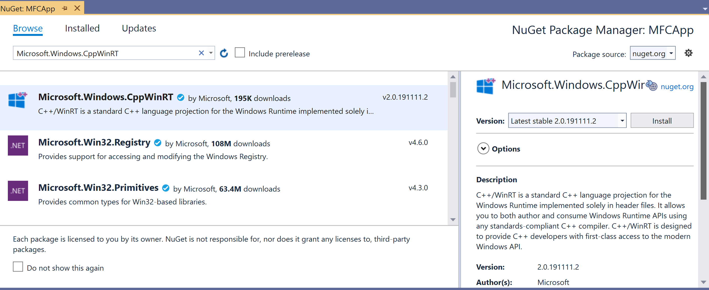
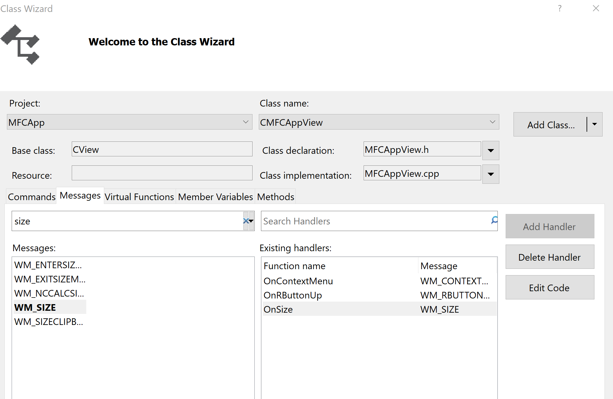

# Host standard UWP controls in MFC MDI project using XAML Islands

This article will help developers to understand how to modernize MFC MDI project with Standard UWP Controls through XMAL Islands. In this sample, we will add XAML RelativePanel, UWP Ink canvas and toolbar into the document view of this MFC MDI project, also enable Event Handling so that MFC can take action once event raised from XAML Controls. The sample MFCAPP solution is [here](https://github.com/freistli/ModernizeApp/tree/master/MFC/MFCApp)

It brings Fluent UI to non-UWP desktops.
Although MFC uses specific framework, it does support C++/WinRT as well. It aligns the pre-requirements and API architecture described in the article [Using the UWP XAML hosting API in a C++ Win32 app](https://docs.microsoft.com/en-us/windows/apps/desktop/modernize/using-the-xaml-hosting-api). Here we mainly explain the specific modernization parts for MFC project.

## Development Environment

* Visual Studio 2019 (16.3.6)  
* Windows 10 1909 (18363.476)  
* Windows 10 SDK (10.0.18362.1) 

## Configure Project

1. Create MFC App in Visual Studio 2019, will name it MFCAPP

    

    Use below configuration to create the MFCAPP project
    
    

    click **Finish** Build and Run it, here is its default UI

     

    
  
2. In Solution Explorer, right-click the MFCAPP project node,    click **Retarget Project**, select the **10.0.18362.0** or    a later SDK release, and then click OK.
 
   

   
 
3.	Install the Microsoft.Windows.CppWinRT NuGet package:

    a.	Right-click the project in Solution Explorer and choose Manage NuGet Packages.
    b.	Select the Browse tab, search for the **Microsoft.Windows.CppWinRT** package, and install the latest version of this package.  

      


    After install the nuget package, check the MFC project properties, you will notice its C++ version is ISO C++17, which is required by C++/WinRT:

    
 
    Build this MFCApp, we can see winrt projected files are generated in the “Generated Files\winrt” folder:

    
 

4.	Install the **Microsoft.Toolkit.Win32.UI.SDK** NuGet          package:

    a.	In the NuGet Package Manager window, make sure that Include prerelease is selected.  
    b.	Select the Browse tab, search for the **Microsoft.Toolkit.Win32.UI.SDK** package, and install version v6.0.0 (or Later) of this package.

    

## Use XAML hosting APIs to host  UWP controls in MFC Document View

1.  Open pch.h, add below code to include necessary winrt header files:

    ```C++
    #pragma push_macro("GetCurrentTime")
    #pragma push_macro("TRY")
    #undef GetCurrentTime
    #undef TRY

    #include <winrt/Windows.Foundation.Collections.h>
    #include <winrt/Windows.system.h>
    #include <winrt/windows.ui.xaml.hosting.h>
    #include <windows.ui.xaml.hosting.desktopwindowxamlsource.h>
    #include <winrt/windows.ui.xaml.controls.h>
    #include <winrt/Windows.ui.xaml.media.h>
    #include <winrt/Windows.UI.Core.h>
    #include <winrt/Windows.UI.Input.Inking.h>
    #include <winrt/Windows.UI.Xaml.Media.Imaging.h>
    #pragma pop_macro("TRY")
    #pragma pop_macro("GetCurrentTime")
    ```
    Regarding the reason of using “GetCurrentTime” and “TRY” macros, please refer to:
    https://docs.microsoft.com/en-us/windows/uwp/cpp-and-winrt-apis/faq

2.	Using winrt namespaces in MFCAPPView.h and MFCAPP.h

    ```C++
    using namespace winrt;
    using namespace Windows::UI;
    using namespace Windows::UI::Composition;
    using namespace Windows::UI::Xaml::Hosting;
    using namespace Windows::Foundation::Numerics;
    using namespace Windows::UI::Xaml::Controls;
    ```
3.  Declare DesktopWindowXamlSource member and AdjustLayout       methods in MFCAPPView.h:

    ```C++
    private:
        DesktopWindowXamlSource _desktopWindowXamlSource{ nullptr };
        
        RelativePanel xamlContainer = RelativePanel{ nullptr };
        TextBlock tb = TextBlock{ nullptr };
        Image image = Image{ nullptr };
        InkCanvas ic = InkCanvas{ nullptr };
        InkToolbar it = InkToolbar{ nullptr };

    public:
        void AdjustLayout();
    ```

 4. Initialize WindowsXamlManager in MFCApp instance.
 
    Add WindowsXamlManager member in MFCAPP.h:

    ```C++
    WindowsXamlManager winxamlmanager = WindowsXamlManager{ nullptr };
    ```

    And initialize XMAL framework core window in MFCAPP.CPP:

    ```C++
    //Initialize the XAML framework's core window for the current thread.
    BOOL CMFCAppApp::InitInstance()
    {
        ...
        winxamlmanager = WindowsXamlManager::InitializeForCurrentThread();
        ...
    }
    ```

5.  In MFCAPPView.CPP, add code into the CMFCAppView::OnDraw function, it adds XAML RelativePanel, TextBox, InkCanvas, and InkToolbar, and a background image into the default document view:

    ```C++
    if (_desktopWindowXamlSource == nullptr)
	{
		//XAML Island section
		

		// This Hwnd will be the window handler for the Xaml Island: A child window that contains Xaml.  
		HWND hWndXamlIsland = nullptr;

		// This DesktopWindowXamlSource is the object that enables a non-UWP desktop application 
		// to host UWP controls in any UI element that is associated with a window handle (HWND).
		_desktopWindowXamlSource = DesktopWindowXamlSource{ };

		// Get handle to corewindow
		auto interop = _desktopWindowXamlSource.as<IDesktopWindowXamlSourceNative>();
		// Parent the DesktopWindowXamlSource object to current window
		check_hresult(interop->AttachToWindow(this->GetSafeHwnd()));

		// Get the new child window's hwnd 
		interop->get_WindowHandle(&hWndXamlIsland);

		RECT size;
		GetWindowRect(&size);
		auto viewWidth = size.right - size.left;
		auto viewHeight = size.bottom - size.top;

		//Creating the Xaml content
		xamlContainer = RelativePanel{};
		
		// Update the xaml island window size becuase initially is 0,0
		::SetWindowPos(hWndXamlIsland, NULL, 0, 0, viewWidth, viewHeight, SWP_SHOWWINDOW);

		tb = TextBlock{};
		tb.Text(L"Modernized MFC");
		tb.VerticalAlignment(Windows::UI::Xaml::VerticalAlignment::Center);
		tb.HorizontalAlignment(Windows::UI::Xaml::HorizontalAlignment::Center);
		tb.FontSize(48);
		xamlContainer.Children().Append(tb);
		
		image = Image{};
		Windows::Foundation::Uri uri(L"ms-appx:///res/viewbackground.png");
		Windows::UI::Xaml::Media::Imaging::BitmapImage bitmapImage(uri);
		image.Source(bitmapImage);

		xamlContainer.Children().Append(image);
		xamlContainer.SetAlignLeftWithPanel(image, true);
		xamlContainer.SetAlignRightWithPanel(image, true);
		xamlContainer.SetBelow(image, tb);
				
		ic = InkCanvas{};
		ic.InkPresenter().InputDeviceTypes(winrt::Windows::UI::Core::CoreInputDeviceTypes::Touch | winrt::Windows::UI::Core::CoreInputDeviceTypes::Mouse);
		xamlContainer.SetAlignLeftWithPanel(ic, true);
		xamlContainer.SetBelow(ic, tb);
		xamlContainer.SetAlignBottomWithPanel(ic, true);
		xamlContainer.SetAlignRightWithPanel(ic, true);
		xamlContainer.Children().Append(ic);

		it = InkToolbar{};
		xamlContainer.Children().Append(it);
		xamlContainer.SetAlignLeftWithPanel(it, true);
		xamlContainer.SetBelow(it, tb);
		it.TargetInkCanvas(ic);
		
		xamlContainer.UpdateLayout();
		_desktopWindowXamlSource.Content(xamlContainer);
		AdjustLayout();
	}
    ```

    Meanwhile, put a **viewbackground.png** in the Res folder. And add this existing item into the Resources folder of project:
    
    

    Set the file's **Content** property as **True**

    

6. Clean up resources when the view is disconstructed

    ```C++
    CMFCAppView::~CMFCAppView()
    {
        if (_desktopWindowXamlSource != nullptr)
        {
            _desktopWindowXamlSource.Close();
            _desktopWindowXamlSource = nullptr;
        }
    }
    ```

7.  Add AdjustLayout function to make XAML content layout properly:

    ```C++
    void CMFCAppView::AdjustLayout()
    {
        if (_desktopWindowXamlSource != nullptr)
        {
            auto interop = _desktopWindowXamlSource.as<IDesktopWindowXamlSourceNative>();
            HWND xamlHostHwnd = NULL;
            check_hresult(interop->get_WindowHandle(&xamlHostHwnd));

            RECT windowRect;
            GetWindowRect(&windowRect);
            ::SetWindowPos(xamlHostHwnd, NULL, 0, 0, windowRect.right - windowRect.left, windowRect.bottom - windowRect.top, SWP_SHOWWINDOW);
        }
    }
    ```
8.  Right click the MFCApp project, select **Class Wizard**: 

    

    Add a handler to handle WM_SIZE so that when view size changes we can handle it: 

    
    

9.  Modify the OnSize method handler:

    ```C++
    void CMFCAppView::OnSize(UINT nType, int cx, int cy)
    {
        CView::OnSize(nType, cx, cy);
        AdjustLayout();
    }
    ```
10. Compile and Run this MFCAPP, if  you see this error message when running the MFC app:

    
 
    To solve it, please add one **app.manifest** in your project with below content:

    ```XML
    <?xml version="1.0" encoding="UTF-8"?>
    <assembly xmlns="urn:schemas-microsoft-com:asm.v1" manifestVersion="1.0">
    <compatibility xmlns="urn:schemas-microsoft-com:compatibility.v1">
        <application>
        <!-- Windows 10 -->
        <maxversiontested Id="10.0.18362.0"/>
        <supportedOS Id="{8e0f7a12-bfb3-4fe8-b9a5-48fd50a15a9a}" />
        </application>
    </compatibility>
    </assembly>
    ```

    Now the project structure is like as below:

    

 11. For the best experience, we recommend that C++ Win32 application is configured to be per-monitor DPI aware. Enable High DPI Awareness **PerMonitorV2** in manifest:

      ```XML
        <?xml version="1.0" encoding="UTF-8"?>
        <assembly xmlns="urn:schemas-microsoft-com:asm.v1" manifestVersion="1.0">
        <compatibility xmlns="urn:schemas-microsoft-com:compatibility.v1">
            <application>
        .....
            <windowsSettings>
                <dpiAwareness xmlns="http://schemas.microsoft.com/SMI/2016/WindowsSettings">PerMonitorV2</dpiAwareness>
            </windowsSettings>
        ......
            </application>    
        </compatibility>
        </assembly>
      ```
Now let's Ctrl+F5 to run this app, it will display as:


 
 You may notice that it doesn't display the background image, since this kind of uri **ms-appx///res/viewbackground.png** needs to be used UWP package. In Visual Studio, with **"Windows Application Packaging Project (C++)"**, it is easily to packaging our MFC app project:


Create the packaging project in the solution, right click the **Application** node, and select **Add Reference**, add MFCApp. Now the packaging project structure is like:


For more information about packaging project, refer to:
[Package a desktop app from source code using Visual Studio](https://docs.microsoft.com/en-us/windows/msix/desktop/desktop-to-uwp-packaging-dot-net)

After this, choose the packaging project as Start Up project, Ctrl+F5 to run it. We can see the expected result will show up:


Further more, you can pubish this packaging app as MSIX or APPX, and easily deploy it:

[Package a UWP app with Visual Studio](https://docs.microsoft.com/en-us/windows/msix/desktop/desktop-to-uwp-r2r)

## Event handling

In previous section, we added some UWP controls such as InkCanvas, InkToolbar, etc... using XAML Islands.
It is really powerful and easy to use. In this section, we will communicate between UWP controls and MFC app using event handler.

### The goal of this section

Adding a new button right of the ruler button at InkToolbar. And handling click event of the button, then open a image file, and then change the background image of InkCanvas to the image file.


1. Add include statements to pch.h to use some WinRT classes, because before using WinRT classes in MFC app, we have to include them:
    ```cpp
    #include <winrt/Windows.Foundation.h>
    #include <winrt/Windows.UI.Xaml.Controls.Primitives.h>
    #include <winrt/Windows.Storage.h>
    #include <winrt/Windows.Storage.Streams.h>
    ```

    Finally, pch.h is as below:
    ```cpp
    // pch.h: This is a precompiled header file.
    // Files listed below are compiled only once, improving build performance for future builds.
    // This also affects IntelliSense performance, including code completion and many code browsing features.
    // However, files listed here are ALL re-compiled if any one of them is updated between builds.
    // Do not add files here that you will be updating frequently as this negates the performance advantage.

    #ifndef PCH_H
    #define PCH_H

    // add headers that you want to pre-compile here
    #include "framework.h"

    //TODO STEP 1: Start
    //Include winrt header files for MFC
    //Refer to https://docs.microsoft.com/en-us/windows/uwp/cpp-and-winrt-apis/faq

    #pragma push_macro("GetCurrentTime")
    #pragma push_macro("TRY")
    #undef GetCurrentTime
    #undef TRY
    #include <winrt/Windows.Foundation.Collections.h>
    #include <winrt/Windows.system.h>
    #include <winrt/windows.ui.xaml.hosting.h>
    #include <windows.ui.xaml.hosting.desktopwindowxamlsource.h>
    #include <winrt/windows.ui.xaml.controls.h>
    #include <winrt/Windows.ui.xaml.media.h>
    #include <winrt/Windows.UI.Core.h>
    #include <winrt/Windows.UI.Input.Inking.h>
    #include <winrt/Windows.UI.Xaml.Media.Imaging.h>
    //TODO STEP1 of EventHandler: Start
    #include <winrt/Windows.Foundation.h>
    #include <winrt/Windows.UI.Xaml.Controls.Primitives.h>
    #include <winrt/Windows.Storage.h>
    #include <winrt/Windows.Storage.Streams.h>
    //TODO STEP1 of EventHandler: End
    #pragma pop_macro("TRY")
    #pragma pop_macro("GetCurrentTime") 
    //TODO STEP 1: End

    #endif //PCH_H
    ```
2. Add using namespaces to MFCAppView.h:
    ```cpp
    using namespace Windows::UI::Xaml;
    using namespace Windows::Foundation;
    using namespace Windows::Storage;
    ```
3. Add a file that type of InkToolbarCustomToggleButton to MFCAppView class:
    ```cpp
    private:
	    InkToolbarCustomToggleButton button = InkToolbarCustomToggleButton{ nullptr };
    ```
4. And create a member function to handling the click event:

    - To MFCAppView.h:
        ```cpp
        private:
            IAsyncAction OpenImageButton_Click(IInspectable const& sender, RoutedEventArgs const& args);
        ```
    - To MFCAppView.cpp:
        ```cpp
        IAsyncAction CMFCAppView::OpenImageButton_Click(IInspectable const& sender, RoutedEventArgs const&)
        {
            // Select an image file using MFC APIs
            CFileDialog dialog{ TRUE, NULL, NULL, OFN_HIDEREADONLY | OFN_CREATEPROMPT, L"Image file|*.jpg;*.jpeg;*.png||" };
            if (dialog.DoModal() != IDOK)
            {
                return;
            }

            // Open the image file and set the image to image control using WinRT APIs
            auto file = co_await StorageFile::GetFileFromPathAsync((LPCTSTR)dialog.GetPathName());
            auto stream = co_await file.OpenReadAsync();
            Windows::UI::Xaml::Media::Imaging::BitmapImage bitmapImage{};
            bitmapImage.SetSource(stream);
            image.Source(bitmapImage);

            // never set to `checked status`
            button.IsChecked(false);
        }
        ```

    As above code snippets, we can use concurrency and asynchrony(co_await keyword) with C++/WinRT almost all same as C#. Please check the following documents:
    - [Concurrency and asynchronous operations with C++/WinRT](https://docs.microsoft.com/en-us/windows/uwp/cpp-and-winrt-apis/concurrency)
    -[More advanced concurrency and asynchrony with C++/WinRT](https://docs.microsoft.com/en-us/windows/uwp/cpp-and-winrt-apis/concurrency-2)

5. Add below code at bottom of creating InkToolbar control on MFCAppView.cpp to add InkToolbarCustomToggleButton to InkToolbar:
    ```cpp
    button = InkToolbarCustomToggleButton{};
    auto icon = SymbolIcon{};
    icon.Symbol(Symbol::OpenFile);
    button.Content(icon);
    ToolTipService::SetToolTip(button, winrt::box_value(L"Open image..."));
    button.Click({ this, &CMFCAppView::OpenImageButton_Click });
    it.Children().Append(button);
    ```

    In this code, adding OpenImageButton_Click member function as click event handler of InkToolbarCustomToggleButton. An event handler is created from pair of a method owner's pointer and a function pointer of member function. If you would like to use lambda function, ofcouse you can use it. Please see the following document:
    - [Handle events by using delegates in C++/WinRT](https://docs.microsoft.com/en-us/windows/uwp/cpp-and-winrt-apis/handle-events)

    And winrt::box_value function is really often used function to boxing scalar values to IInspectable that is root interface of every runtime class in WinRT. For C# developers, IInspectable class is like System.Object. For details of winrt::box_value function, please check the following document:
    - [Boxing and unboxing scalar values to IInspectable with C++/WinRT](https://docs.microsoft.com/en-us/windows/uwp/cpp-and-winrt-apis/boxing)

Now, let's press F5, then we can see a window that is added a new button to InkToolbar, same as images that are top of in this section.


## Wrap Up
This article gives detailed steps on how to use XAML Hosting APIs to integrate various standard UWP XMAL controls in document view of traditional MFC Mulitple Document Interface project, and optionally you can package the MFC app to MSIX or APPX packages and deploy it like a UWP app, expalain how to handle event raised from XMAL Controls in MFC. The whole smaple solution can be found from this repo: https://github.com/freistli/ModernizeApp/tree/master/MFC/MFCApp